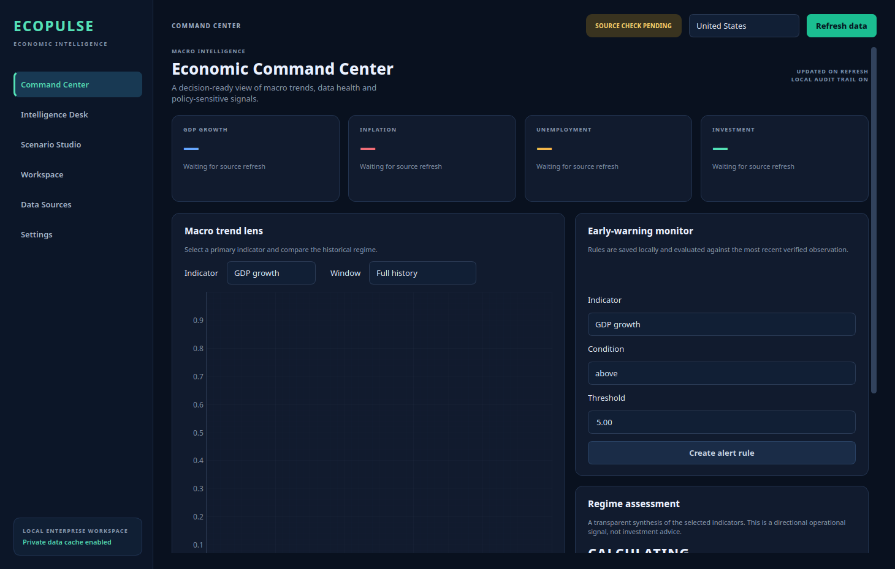

# EcoPulse Desktop

> **A Windows economic-intelligence workstation for transparent macro monitoring, controlled scenarios and locally auditable decisions.**

EcoPulse Desktop upgrades the original Dash prototype into a native, Windows-ready workstation. It supplies a high-density desktop interface, provider-aware macro trends, deterministic offline continuity, locally stored alert rules, scenario controls, CSV evidence export and a local audit trail.



## Delivered capabilities

| Capability | What it does | Business value |
| --- | --- | --- |
| **Economic Command Center** | Displays GDP growth, inflation, unemployment and investment trends for the selected economy. | Establishes a decision-ready macro overview. |
| **Provider-aware data layer** | Requests public World Bank indicators and labels deterministic fallback data when the source is unavailable. | Protects continuity and preserves source transparency. |
| **Early-warning controls** | Saves local threshold rules and evaluates them on each refresh. | Makes risk monitoring repeatable. |
| **Scenario Studio** | Lets the user apply explicit growth, inflation and labour shocks to a transparent planning heuristic. | Supports documented what-if analysis. |
| **Evidence workspace** | Provides provenance-labelled CSV export and a local SQLite audit trail for alerts, refreshes, exports and scenarios. | Creates a lightweight reviewable decision record. |
| **Windows packaging** | Builds a `dist\EcoPulse.exe` package through `build_windows.bat`. | Produces a portable Windows application without a browser server. |

## Product and data rationale

Commercial economic-data products compete on breadth, release awareness, methodology and scenario capability—not only visualization. Trading Economics documents APIs for historical indicators, live calendars, markets and forecasts, while Moody’s describes alternative economic scenarios as the foundation for what-if analysis in risk management and planning.[1][2]

The starter edition begins with the World Bank Indicators API, which documents programmatic access to almost 16,000 time-series indicators without an API key.[3] FRED is a natural optional next adapter because its API supports observations, releases and vintage dates.[4] Public data must not be treated as a replacement for licensed real-time market, calendar or proprietary forecast content.

## Run locally

```bash
python -m pip install -r requirements.txt
python main.py
```

EcoPulse stores its local workspace under `%APPDATA%\EcoPulse` on Windows. If the public provider is unavailable, the interface stays operational using clearly labelled fallback series.

## Build the Windows executable

From a 64-bit Windows terminal, run:

```bat
build_windows.bat
```

The package will appear at `dist\EcoPulse.exe`. Build on Windows: PyInstaller creates an operating-system and architecture-specific bundle, so a Windows artifact must be produced on a Windows environment.[5]

> Before commercial distribution, sign the executable and installer with an organization-approved code-signing certificate, scan the release artifact and publish integrity checksums.

## Quality check

The offline smoke test verifies fallback series, local persistence, application construction, data rendering, metric cards and the scenario engine:

```bash
set QT_QPA_PLATFORM=offscreen
python smoke.py
```

## Enterprise roadmap

| Horizon | Recommended capability | Commercial outcome |
| --- | --- | --- |
| Next release | Release-calendar integration, custom country groups, multi-series overlays, user notifications, Excel export and data-vintage display. | Faster research workflow. |
| Professional | Licensed data adapters, consensus comparison, research notes, report generation, templates and managed deployment. | Team-scale analysis. |
| Enterprise | OIDC/SAML SSO, RBAC, SCIM, central audit, shared workspaces, entitlement controls, model registry and managed updater. | Governed organizational deployment. |
| Differentiation | Nowcasting, surprise scoring, explainable regime classification, scenario libraries and industry exposure mapping. | A defensible intelligence product. |

## Security boundary

The current application includes no provider keys and sends no local-workspace data to a remote service. Production licensed adapters should obtain credentials from an organization-approved secret manager or identity broker; never place secrets in source control or embed them in a desktop binary.

## References

[1] [Trading Economics API](https://tradingeconomics.com/api/)

[2] [Moody’s Analytics — Economic Scenarios](https://www.economy.com/products/alternative-scenarios/standard-scenarios)

[3] [World Bank — Indicators API documentation](https://datahelpdesk.worldbank.org/knowledgebase/articles/889392-about-the-indicators-api-documentation)

[4] [Federal Reserve Bank of St. Louis — FRED API](https://fred.stlouisfed.org/docs/api/fred/)

[5] [PyInstaller — operating mode](https://pyinstaller.org/en/stable/operating-mode.html)
